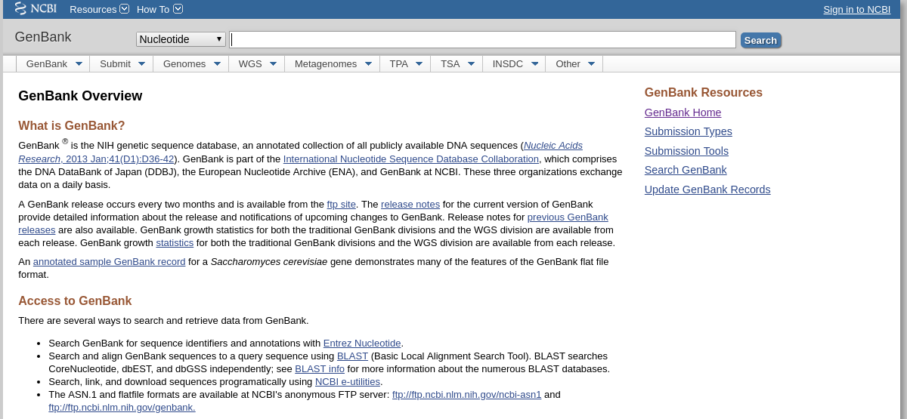
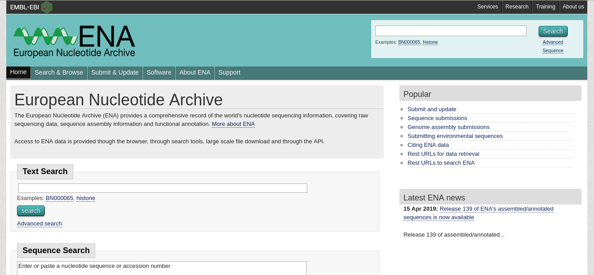
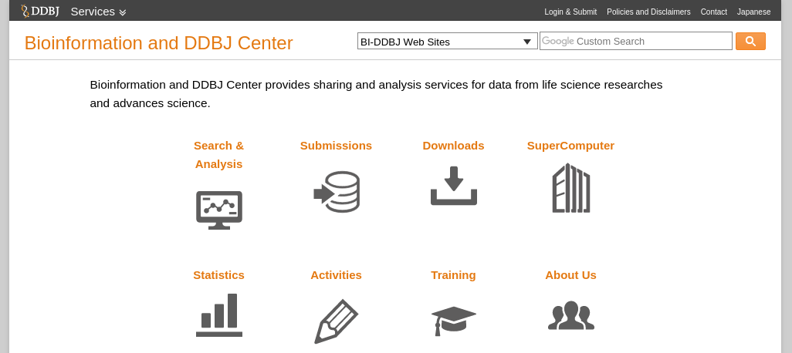
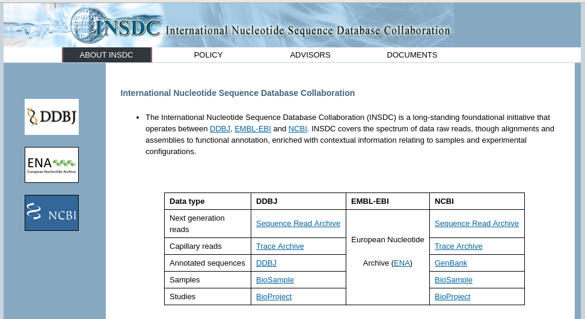
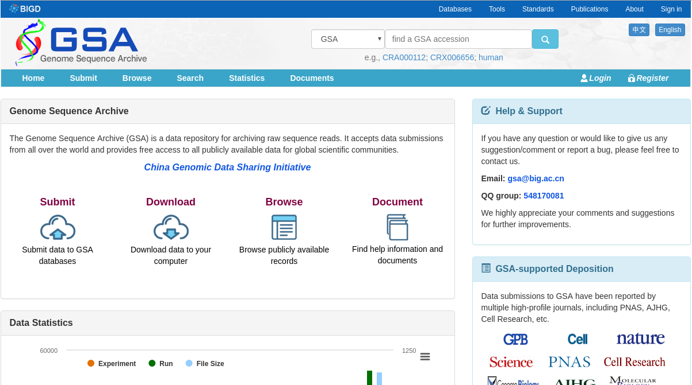
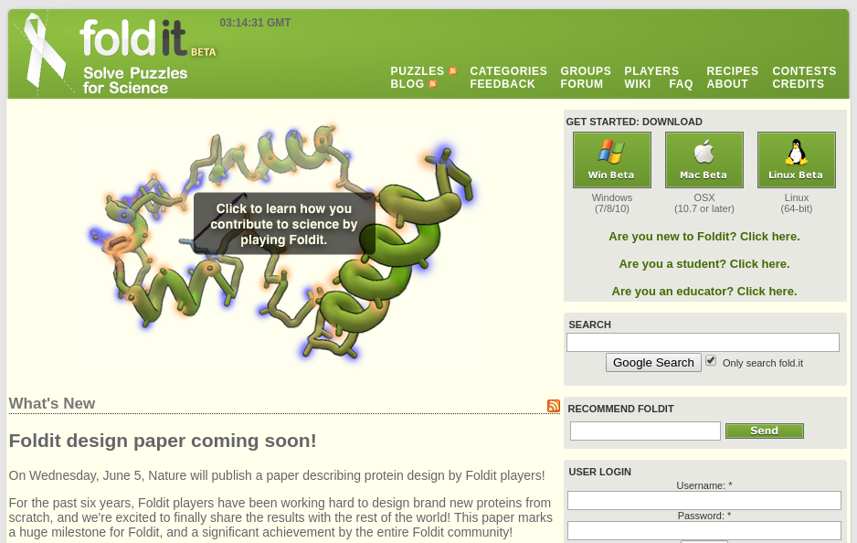
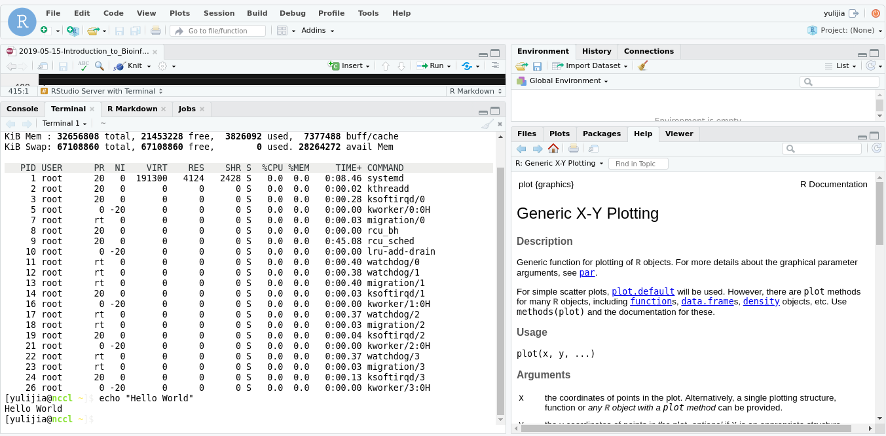

background-image: url(https://image.slidesharecdn.com/bis2016introtobioinformatics-160909094908/95/introduction-to-bioinformatics-26-638.jpg)

```{r setup, include=FALSE}
options(htmltools.dir.version = FALSE)
```

---

background-image: url(http://acm.na.edu/img/bioInfoLab/bioinformatics_venn.png)
background-size: 350px
background-position: 50% 65%

# What is Bioinformatics?

###  Bioinformatics is the field of science in which <u>biology</u>, <u>computer science</u>, and <u>information technology</u> merge into a single discipline. <sup>1</sup>


.footnote[
[1] Molecular Biology Review - NCBI

[2] Venn diagram: http://acm.na.edu/img/bioInfoLab/bioinformatics_venn.png
]

???

The ultimate goal of the field is to enable the discovery of new biological insights as well as to create a global perspective from which unifying principles in biology can be discerned. 

- the development of new algorithms and statistics with which to assess relationships among members of large data sets

- the analysis and interpretation of various types of data including nucleotide and amino acid sequences, protein domains, and protein structures

- the development and implementation of tools that enable efficient access and management of different types of information
---

<!-- # Milestones   -->

<!-- - In 1956, Symposium on Information Theory in Biology (Gatlinburg, USA). -->

<!-- -- -->

<!-- - In 1962, Zuckerkandl and Pauling's Molecular Clock -->


<!--   -->

<!-- ??? -->

<!-- 在20世纪50年代前后，已有一些实验室开始测定蛋白质序列的信息，例如1947年测出短杆菌的五肽结构，1951年重构胰岛素的30个氨基酸，几乎在同一时期，科学家认识到DNA是遗传物质。 -->


<!-- --- -->

# 1. Molecular data collection and management 

- In 1979, <u>**GenBank**</u> was established at Los Alamos National Laboratory (USA).




---

# 1. Molecular data collection and management 

- In 1979, <u>**GenBank**</u> was established at Los Alamos National Laboratory (USA).

.center[]
 
---

# 1. Molecular data collection and management 

- In 1982, nucleotide sequence database of European Molecular Biology Laboratory
(also known as <u>**EMBL-Bank**</u>) was created (Europe).





???

The EMBL Nucleotide Sequence Database (also known as EMBL-Bank) is the section of the ENA which contains high-level genome assembly details, as well as assembled sequences and their functional annotation.

As of release 114 (December 2012), the EMBL Nucleotide Sequence Database contains approximately 5×1011 nucleotides with an uncompressed filesize of 1.6 terabytes.


---

# 1. Molecular data collection and management 

- In 1986, DNA Data Bank of Japan (<u>**DDBJ**</u>) began data bank activities at 
National Institute of Genetics (Japan).



---

# 1. Molecular data collection and management 

- In the early 1990s, International Nucleotide Sequence Database Collaboration
(INSDC) was founded in cooperation of Genebank/EMBL/DDBJ.

.center[]


---

# 1. Molecular data collection and management

- Big Data Center: The Genome Sequence Archive (GSA) is a data repository for archiving raw sequence reads. 


.center[]


<!-- --- -->


<!-- # 1. Molecular data collection and management -->

<!-- ## Omics -->

<!-- - Genomics -->
<!--       - Comparative genomics -->
<!--       - Functional genomics -->
<!--       - Metagenomics -->
<!--       - Neurogenomics -->
<!--       - Pan-genomics -->
<!--       - **Personal genomics** -->

<!-- - Transcriptomics -->

<!-- - Epigenomics -->

<!-- - Proteomics -->

---

# 2. Sequence alignment

- In 1962, Zuckerkandl and Pauling introducing the concept of the "molecular clock", which enabled the neutral theory of molecular evolution.

.center[]


???

In bioinformatics, a sequence alignment is a way of arranging the sequences of DNA, RNA, or protein to identify regions of similarity that may be a consequence of functional, structural, or evolutionary relationships between the sequences.

1962年莱纳斯·鲍林和艾美·祖柯坎（Emile Zuckerkandl）提出了分子时钟，透过比较同源蛋白质的差异来推算双方分歧的时间。


<!-- # 2. Sequence alignment -->

<!-- .center[] -->

---

# 2. Sequence alignment

| position | 1 | 2 | 3 | 4 | 5 | 6 | 7 | 8 | 9 | 10 | 11 | 12 | 13 | 14 | 
|------------|---|---|---|---|---|---|---|---|---|---|---|---|---|---|
| sequence 1 | G | C | A | T | G | A | C | G | A | A | T | C | A | G |
| sequence 2 | T | A | T | G | A | C | A | A | A | C | A | G | C |   |


--

Delete(1,-)


| position | 1 | 2 | 3 | 4 | 5 | 6 | 7 | 8 | 9 | 10 | 11 | 12 | 13 | 14 | 
|------------|---|---|---|---|---|---|---|---|---|---|---|---|---|---|
| sequence 1 | G | C |<font color="red"> A </font> |<font color="red"> T </font> |<font color="red"> G  </font>| <font color="red">A </font> | <font color="red">C </font>| G | <font color="red">A  </font>|<font color="red"> A  </font>| T | C | A | G |
| sequence 2 |   | T | <font color="red"> A </font>| <font color="red"> T </font> |<font color="red"> G  </font>| <font color="red">A </font> | <font color="red">C </font>| A | <font color="red">A  </font>|<font color="red"> A  </font>| C | A | G | C |

--


Delete(8,-)

| position | 1 | 2 | 3 | 4 | 5 | 6 | 7 | 8 | 9 | 10 | 11 | 12 | 13 | 14 | 15 | 
|------------|---|---|---|---|---|---|---|---|---|---|---|---|---|---|---|
| sequence 1 | G | C |<font color="red"> A </font> |<font color="red"> T </font> |<font color="red"> G  </font>| <font color="red">A </font> | <font color="red">C </font>| G | <font color="red">A  </font>|<font color="red"> A  </font>| T | <font color="red">C </font>| <font color="red"> A </font>| <font color="red"> G  </font> | |
| sequence 2 |   | T | <font color="red"> A </font>| <font color="red"> T </font> |<font color="red"> G  </font>| <font color="red">A </font> | <font color="red">C </font>| -- |<font color="red">A  </font>|<font color="red"> A  </font>| A | <font color="red">C </font>| <font color="red"> A </font>| <font color="red"> G  </font> | C |

---

# 2. Sequence alignment


- Hamming Distance


--

| Hamming Distance(s,t)= |  2  |   3   |     5    |
|:----------------------:|:---:|:-----:|:--------:|
|           s=           | <font color="red"> A </font>A<font color="red"> T </font> | A<font color="red">GCA</font>A | A<font color="red"> GCAC</font>A<font color="red"> C</font>A |
|           t=           | <font color="red"> T </font>A<font color="red"> A </font> | A<font color="red"> CAT</font>A | A<font color="red"> CACA</font>A<font color="red"> T</font>A |

--

- scoring matrix

|BLOSUM 62 Matrix|PAM 250 Matrix|
|---|---|
|||


 <!-- s=c("A","T","A") -->
 <!-- t=c("T","A","A") -->
 <!-- sum(s!=t) -->

???

BLOSUM矩阵由Henikoff提出，蛋白质短序列比对推导

PAM矩阵由Dayhoff提出，蛋白质全局序列比对推导

---

# 3. Genome Analysis

| Genome                                                             | Where                    | Year |
|--------------------------------------------------------------------|--------------------------|------|
| H. Influenza                                                       | TIGR                     | 1995 |
| E. Coli K-12                                                       | Wisconsin                | 1997 |
| S. cerevisiae (yeast)                                              | internat. collab.        | 1997 |
| C. elegans (worm)                                                  | Washington U./Sanger     | 1998 |
| Drosophila M. (fruit fly)                                          | multiple groups          | 2000 |
| E. Coli 0157:H7 (pathogen)                                         | Wisconsin                | 2000 |
| **H. Sapiens (that’s us)**                                             | internat. collab./Celera | 2001 |
| Mus musculus (mouse)                                               | internat. collaboration  | 2002 |
| Oryza sativa L. ssp. indica & Oryza sativa L. ssp. japonica (rice) | internat. collaboration  | 2002 |

---

# 3. Genome Analysis

- Cancer genome mutation


.center[
]

.footnote[
[1] Cancer Genome Landscapes
]

---

# 3. Genome Analysis

- Genetic disease

.center[
]


.footnote[
[1] https://ghr.nlm.nih.gov/condition/huntington-disease#genes
]


???

The HTT mutation that causes Huntington disease involves a DNA segment known as a CAG trinucleotide repeat.

---

<!-- # 4. Transcriptome Analysis -->

<!-- - DNA microarry -->

<!-- The original nucleic acid arrays were macro arrays approximately 9 cm × 12 cm and the first computerized image based analysis was published in 1981. It was invented by Patrick O. Brown. -->

<!-- .center[] -->


<!-- --- -->

# 4. Transcriptome Analysis

.center[]


---


# 4. Transcriptome Analysis


.center[]


---


# 4. Transcriptome Analysis


.center[]

---

# 5. Proteome Analysis


.footnote[
[1] https://ib.bioninja.com.au/standard-level/topic-2-molecular-biology/24-proteins/proteome.html
]

---

# 5. Proteome Analysis


.center[]


.footnote[
[1] [Introduction to Practical Biochemistry
](https://www.tankonyvtar.hu/en/tartalom/tamop412A/2011-0073_introduction_practical_biochemistry/ch11s03.html)
<!-- (http://elte.prompt.hu/sites/default/files/tananyagok/IntroductionToPracticalBiochemistry/ch11s03.html) -->
]

---

# 5. Proteome Analysis


.center[]

 
---

# Related knowledge

1. Biology: **Cell Biology**, **Molecular Biology**, Biochemistry, Developmental Biology, **Genomics**, **Genetics**, etc.

--

2. Programming: **R**, Perl/**Python**, C/C++, etc.

--

3. Statistics: **Hypothesis test**, **Interval estimation**, **Significance**, **Regression**, etc.


<!--.center[]-->

---

# Bioinformatics in Action


- High performance computing

.center[]

.footnote[
[1] [Multiple users concept](http://help.mamut.com/uk/mhelp/rtm/administrator/installation/server/multi_user_concept.htm)
]

---
background-image: url(https://upload.wikimedia.org/wikipedia/commons/thumb/1/1b/R_logo.svg/310px-R_logo.svg.png)
background-size: 100px
background-position: 90% 8%

.left-column[
  ## What is R?
]
.right-column[

<br/>
<br/>
<br/>
<br/>
**R** is a language and environment for statistical computing and graphics. Designed by: **R**oss Ihaka, **R**obert Gentleman.

```{r, fig.height=4, dev='svg'}
x <- 1:6  # Create vector.
y <- x^2  # Create vector by formula.
plot(x,y,type = "b")
```

]


---

.left-column[
  ## What is R?
  ## What is RStudio?
]
.right-column[


]

---

# RStudio Server with Terminal



--

- Login to 192.168.0.105:8787


---


# Syllabus

- Basic knowledge of Linux
- NGS Data analysis (Genome data)
- NGS analysis online tools and Database

# Resource

[1] [Bioinformatics (For undergraduates)](http://xue.biocuckoo.org/course.html) (in Chinese)


.footnote[
* All pictures without footnote are getting from Wikipedia or browser snapshots.
]


---

class: center, middle

# Thanks!

Slides created via the R package [**xaringan**](https://github.com/yihui/xaringan).

The chakra comes from [remark.js](https://remarkjs.com), [**knitr**](http://yihui.name/knitr), and [R Markdown](https://rmarkdown.rstudio.com).
